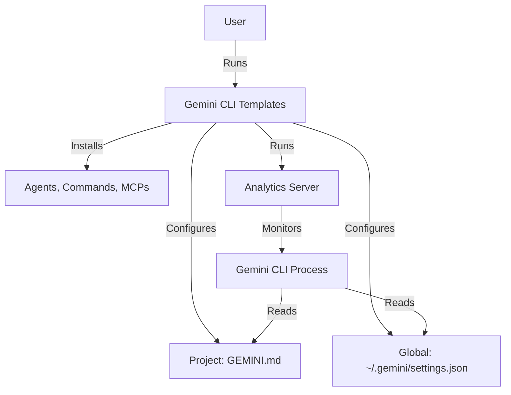

# Design: Gemini CLI Templates Architecture

## 1. High-Level Architecture
The architecture remains a CLI-first tool (`gemini-cli-templates`) that acts as a package manager and companion app for the official `@google/gemini-cli`.



## 2. CLI Tool Design (`cli-tool/`)

### 2.1 Entry Point & Branding
- **Binary Name:** `gemini-templates`
- **Package Name:** `@google/gemini-cli-templates` (Proposed) or `gemini-cli-templates`.
- **Theme:** Use Google's color palette (Blue/White/Multi-color) for CLI output (replacing Google's specific styling).

### 2.2 Component Installation Logic
The `installComponent` function in `src/index.js` will be refactored to handle Gemini targets.

#### A. Agents (The "Persona" System)
*Old:* `CLAUDE.md` "Project Overview" injection.
*New:* `GEMINI.md` Injection.
- **Format:**
  ```markdown
  # Project Context
  ...
  ## Active Agent: [Agent Name]
  [Agent System Prompt content]
  ```
- **Strategy:** Append or replace sections in `GEMINI.md`.

#### B. Commands (Slash Commands)
*Old:* Added to `CLAUDE.md` or `.gemini/commands`.
*New:* Gemini Custom Commands.
- **Location:** `~/.gemini/extensions/` or `GEMINI.md` (Research confirms `GEMINI.md` can define context, but executable commands might need specific extension handling).
- **Fallback:** If executable commands aren't easily defined in markdown, we will generate simple shell scripts or alias definitions compatible with Gemini's execution environment.

#### C. MCPs (Integrations)
*Old:* `.gemini/config.json` (`mcpServers` key).
*New:* `~/.gemini/settings.json`.
- **Format:**
  ```json
  {
    "mcpServers": {
      "github": {
        "command": "npx",
        "args": ["-y", "@modelcontextprotocol/server-github"]
      }
    }
  }
  ```
- **Action:** The CLI will parse `~/.gemini/settings.json`, merge the new MCP config, and save.

### 2.3 Migration & Conversion Engine
To handle the "Cool Solution" (Native Conversion), we will implement a **Transformation Pipeline**:

1.  **Source:** Read existing `gemini-code-templates` markdown file.
2.  **Transform:**
    - `RegexReplace`: `s/Gemini/Gemini/g`, `s/Google/Google/g`.
    - `ContextAwareReplace`: Identify "Project Overview" blocks and retitle to "Context".
3.  **Output:** Write to destination (user's project).

*Note: We will also perform a "One-Time Migration" of the entire repository content (the 800+ files) so the source itself is "Gemini Native".*

## 3. Analytics Engine Design (`cli-tool/src/analytics/`)

### 3.1 Process Monitoring
- **Target:** `process.name == 'gemini'` (or node process running the cli).
- **Log Parsing:** Gemini CLI uses standard I/O. We will need to attach to or tail the terminal buffer if possible, or rely on polling system state.
- *Assumption:* The existing "screenshot/OCR" or "terminal hook" approach used for Gemini might need adjustment. If the current analytics uses file watching (`conversation.json`), we must find the equivalent `~/.gemini/history` or similar.
    - *Research needed:* Does Gemini CLI log history to a file?
    - *Fallback:* Monitor the `GEMINI.md` last access time or strictly process up-time.

### 3.2 Dashboard (Frontend)
- **Visuals:** Rebrand headers, icons, and empty states.
- **Terminology:** "Gemini is thinking" -> "Gemini is generating".

## 4. Directory Structure Changes

```
/
├── cli-tool/
│   ├── components/         # The converted template database
│   │   ├── agents/         # Converted to Gemini-speak
│   │   ├── commands/       # Converted to Gemini formats
│   │   └── mcps/           # JSON configs for Gemini
│   ├── src/
│   │   ├── managers/       # GeminiConfigManager.js
│   │   └── utils/          # GeminiTextConverter.js
├── scripts/
│   └── migrate_repo.js     # One-off script to convert this repo
└── GEMINI.md               # Replaces CLAUDE.md
```

## 5. Deployment & API
- **NPM:** Publish as `gemini-cli-templates`.
- **API:** Reuse existing Vercel functions, just update the validation logic to allow "gemini" client types.
